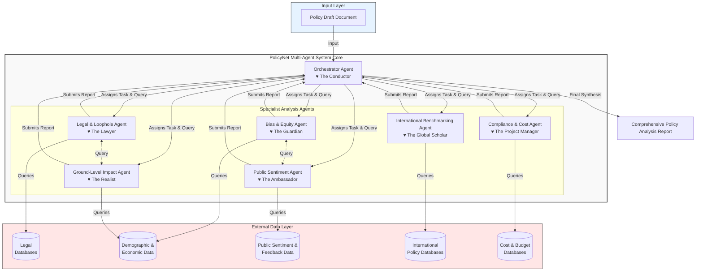

# PolicyNetBE: AI-Powered Policy Analysis Backend

PolicyNetBE is a sophisticated backend system that leverages GenAI to provide comprehensive policy analysis through multiple specialized agents. The system analyzes policies across various dimensions including legal compliance, social equity, budget implications, and international benchmarks.

## System Architecture



## Features

- **Multi-Agent Analysis System**: Specialized agents for different aspects of policy analysis:
  - Legal & Loophole Agent
  - Bias & Equity Agent
  - Compliance & Budget Agent
  - International Benchmarking Agent
  - Sentiment Analysis Agent

- **Real-Time Data Integration**:
  - Indian Kanoon Legal Database
  - Census of India Demographics
  - National Family Health Survey (NFHS)
  - World Bank Open Data
  - UN SDG Indicators
  - Press Information Bureau (PIB)

- **Advanced LLM Integration**:
  - Support for multiple LLM providers (GitHub Models, Google Gemini)
  - Configurable model parameters
  - Rate limiting and error handling
  - Async processing capabilities

## Technology Stack

- **Framework**: FastAPI
- **AI/ML**: LangChain, LangGraph
- **Language**: Python 3.13+
- **Data Processing**: BeautifulSoup4, httpx
- **Documentation**: Pydantic models

## Prerequisites

- Python 3.13 or higher
- Virtual environment (recommended)
- API keys for:
  - GitHub Models or Google Gemini
  - data.gov.in (optional)
  - World Bank API (optional)

## Installation

1. Clone the repository:
```bash
git clone https://github.com/yourusername/PolicyNetBE.git
cd PolicyNetBE
```

2. Create and activate a virtual environment:
```bash
python -m venv env
source env/bin/activate  # On Windows: .\env\Scripts\activate
```

3. Install dependencies:
```bash
pip install -r requirements.txt
```

4. Set up environment variables:
```bash
# Create .env file with your API keys
LLM_PROVIDER=github  # or google
GITHUB_TOKEN=your_github_token
GOOGLE_API_KEY=your_google_api_key
OPENAI_API_MODEL=gpt-4o-mini
DATA_GOV_IN_KEY=your_data_gov_key
```

## Usage

1. Start the FastAPI server:
```bash
uvicorn main:app --reload
```

2. Send a policy draft for analysis:
```python
POST /analyze_policy
{
    "title": "Universal Healthcare Initiative 2025",
    "category": "healthcare",
    "content": "Policy content...",
    "state": "Maharashtra",
    "budget_estimate": 50000,
    "target_beneficiaries": "All residents",
    "implementation_timeline": "2025-2030"
}
```

3. Get analysis results:
```python
GET /analysis_status/{policy_id}
```

## API Endpoints

- `POST /analyze_policy`: Submit a policy for analysis
- `GET /analysis_status/{policy_id}`: Check analysis status
- `GET /report/{policy_id}`: Get comprehensive analysis report

## Project Structure

```
PolicyNetBE/
├── main.py              # Main FastAPI application
├── requirements.txt     # Project dependencies
├── .env                # Environment variables
└── env/                # Virtual environment
```

## Configuration

The system can be configured through environment variables:

- `LLM_PROVIDER`: Choose between 'github' or 'google'
- `MODEL_NAME`: Specific model to use
- `MAX_TOKENS`: Token limit for LLM responses
- `TIMEOUT_SECONDS`: API timeout configuration

## Contributing

1. Fork the repository
2. Create your feature branch
3. Commit your changes
4. Push to the branch
5. Create a new Pull Request

## License

This project is licensed under the MIT License - see the LICENSE file for details.

## Acknowledgments

- Indian Kanoon for legal database access
- Census of India for demographic data
- World Bank for international indicators
- UN SDG framework for sustainability metrics